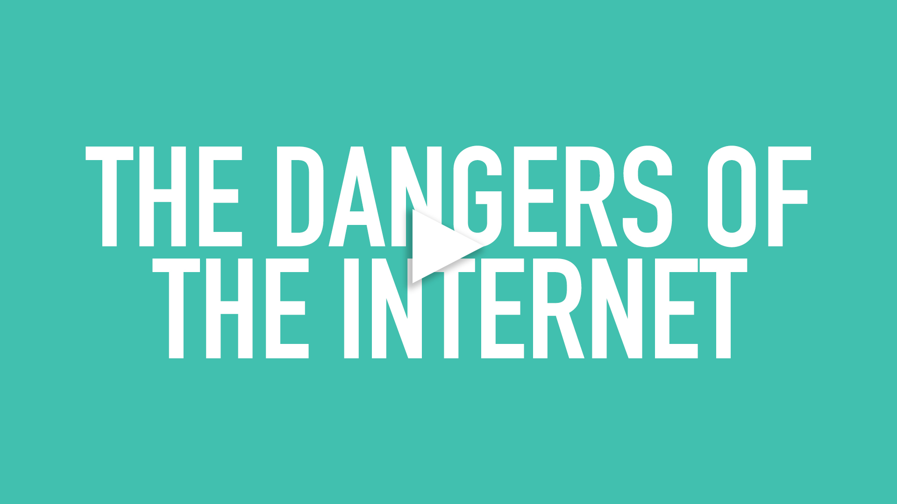

# hci-assignment-3
## A major problem at a minor scale
There are a vast number of extremely dire and alarming issues that the world (the younger generations in particular) are facing, and will continue to have to face in our lifetimes. A sense of hopelessness surrounds many, if not most, because as individuals there is very little we can do to deter the rapidly increasing affects of climate change, stop illegal behavior of the global elite, provide access to health care, food, and education for the underprivilidged, and provide a secure and accepting world for the next generation to grow up in regardless of their personal identity. 

There is a ideology that I believe in, however, that says before you can fix the world, you must fix your home, and before you can fix your home, you must fix yourself. And today, when so much of our lives moved so rapidly to this intangible digital space somewhere between on screen in front of us and all around us, we never really took the time to look at what was really happening and how it was affecting us. In the mental health revolution that has been occuring in recent years, I think it's time to look specifically at how we can improve our mental health by improving our relationships to our devices and the internet. 

## A dangerous vice

