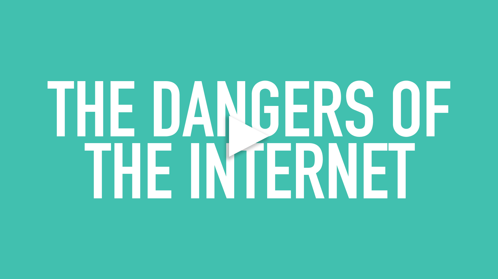

# Digital Wellness
## A major problem at a minor scale
There are a vast number of extremely dire and alarming issues that the world (the younger generations in particular) are facing, and will continue to have to face in our lifetimes. A sense of hopelessness surrounds many, if not most, because as individuals there is very little we can do to deter the rapidly increasing affects of climate change, stop illegal behavior of the global elite, provide access to health care, food, and education for the underprivilidged, and provide a secure and accepting world for the next generation to grow up in regardless of their personal identity. 

There is a ideology that I believe in, however, that says before you can fix the world, you must fix your home, and before you can fix your home, you must fix yourself. And today, when so much of our lives moved so rapidly to this intangible digital space somewhere between on screen in front of us and all around us, we never really took the time to look at what was really happening and how it was affecting us. In the mental health revolution that has been occuring in recent years, I think it's time to look specifically at how we can improve our mental health by improving our relationships to our devices and the internet. 

## A dangerous vice

Building on my point from the introduction, the truth that so many of us are hooked on social media in particular is something that exhibits as an issue that is within us, and therefore something that we can and should focus on as a priority over other issues. Something that social media, and social media companies depend on is your willingness to make every problem your problem. That is what keeps your attention, and what makes them money. Our attention is the most valueable thing we have. Our inability to recognize or control how often we toss away hours upon hours mindlessly scrolling through walls of pictures and posts and links that do little to improve our lives is an epidemic. We weren't meant for 24 hours news and the constant bombardment of media, advertisement, and notifications.

So what can we do?

## Better habits

There are a number of ways to facilitate a healthier relationship between you and the internet, but ultimately it comes down to what works for you. We each interact with the internet in different ways, so what is enough for one person may not be for someone else. In her article, "Glued To Your Phone? Here's How To Rethink Your Relationship With Social Media," Mayowa Aina emphasizes that even though the thinking that our interactions on the internet are not _real_ that we should not take it for granted that these interactions do not have _real_ impacts on us and our wellbeing. 
